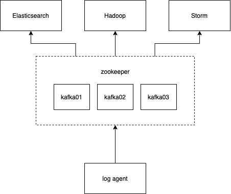

[](https://travis-ci.com/jameshih/gologger)

# Log Collector

Basic implementation of log collector in Golang.

## System Architecture

### Overview



### Log agent


## Configuration

Configure settings in the ini format at **_main/logagent.conf_**

```
[logs]
log_level=debug
log_path=./logs/logagent.log

[collect]
log_path=./logs/logagent.log
topic=logs
chan_size=100

[kafka]
server_ip=localhost
server_port=9092
```

## Execution

- dockerized kafka is currently a single machine setup, but you can modify **_docker-compose.yml_** to run multiple kafkas in the same container, zookeeper is already included ( refer to [wurstmeister/kafka-docker](https://github.com/wurstmeister/kafka-docker) for multi machines and aws configurations)
- a simple kafka consumer is located in the kafka-consumer folder, if it doesn't work make sure you <code>chmod +x ./consumer.sh</code> and have an active kafka running
- to change the name of the topic, it's located in both **_main/logagent.conf_** and **_tools/kafka-consumer/consumer.sh_**, make sure the topic name match for consumer to work

```
// start kafka, etcd, elasticsearch, and kibana containers first
cd docker
docker-compose up -d

// run go program
cd ..
go mod vendor
cd main
go build
./main

// set test etcd config
cd ..
cd tools/setConf
go run main.go

// start consumer to get kafka logs
cd ..
cd kafka-consumer
./consumer.sh
```

## Todo

- [ ] Add test
- [x] Add etcd for storing kafka config
- [x] Implement Elastic Search interface
- [x] dockerized etcd
- [x] added mysql

## Bugs

- [ ] SendToKafka won't exit when etcd key is deleted the second time during a single ./main execution
